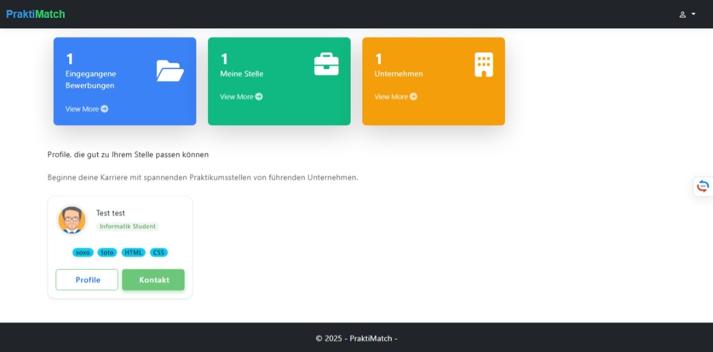
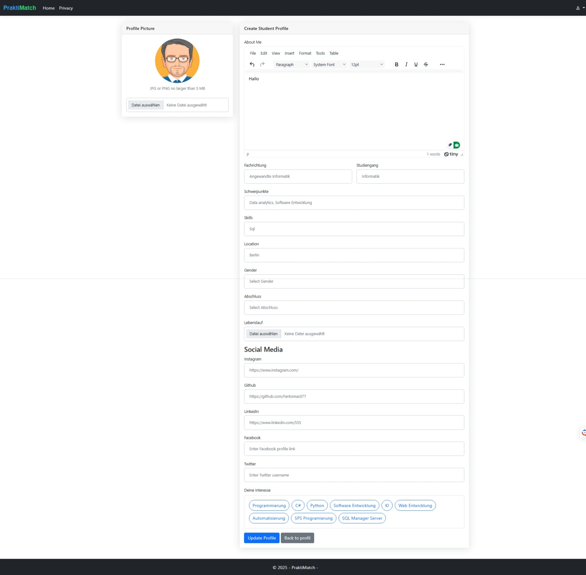
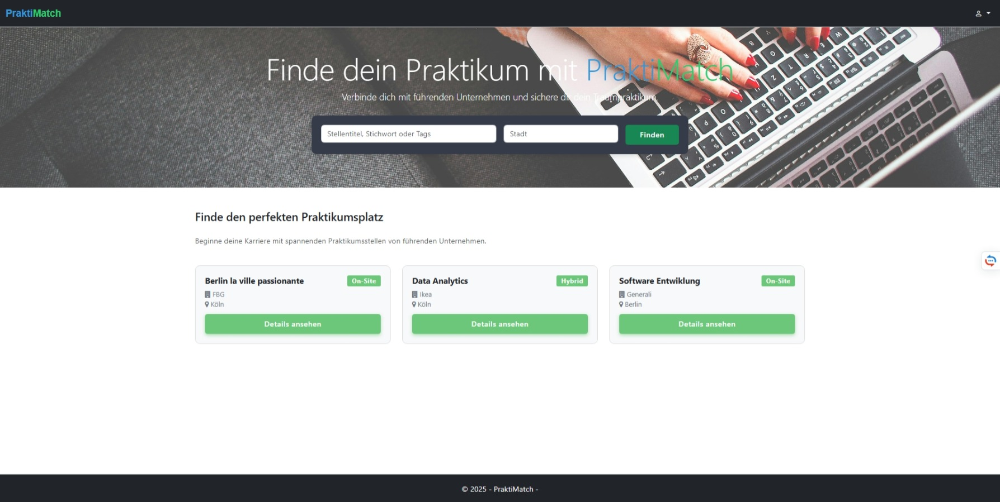
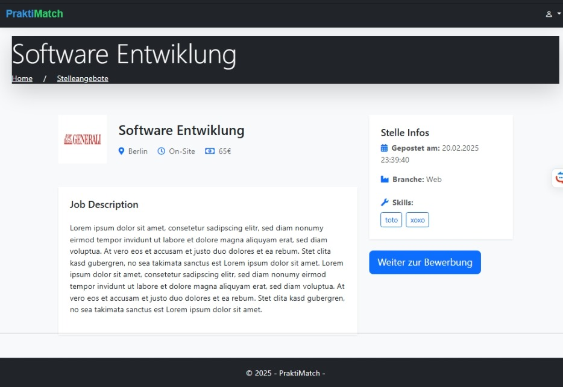
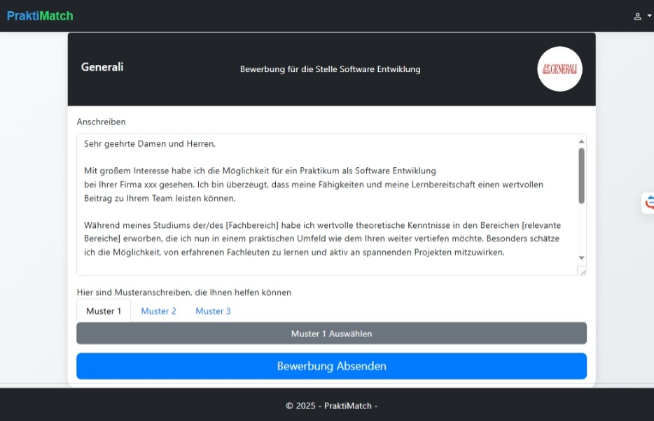
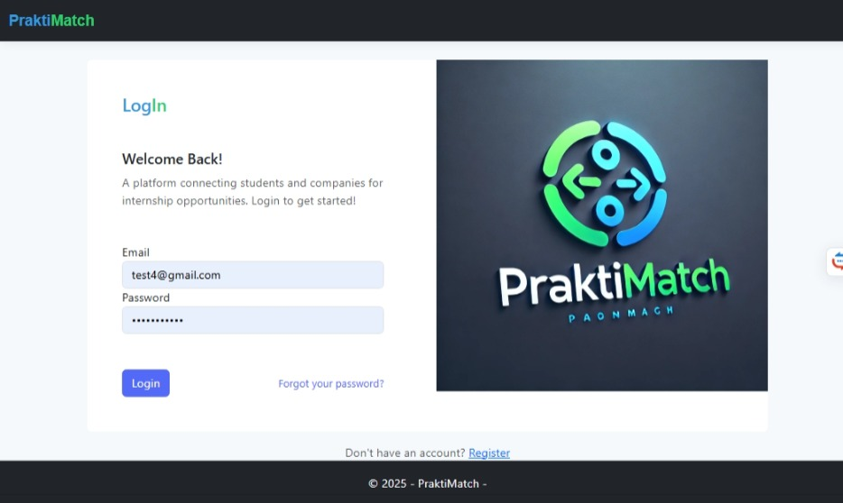
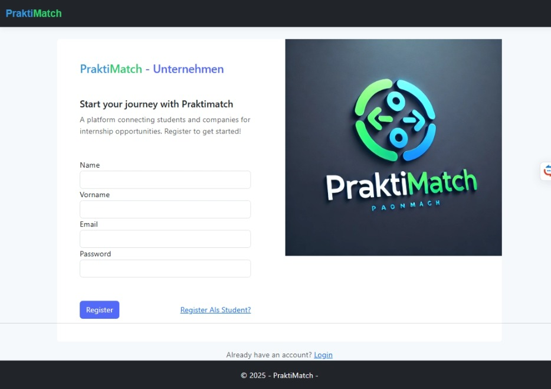

# 🎓 PraktiMatch

**PraktiMatch** ist eine innovative Plattform, die **Studenten** und **Unternehmen** bei der Vermittlung von Praktikumsplätzen unterstützt.  
Sie bietet moderne Funktionen wie **Profilverwaltung**, **intelligente Empfehlungen**, und eine integrierte **Bewerbungsfunktion**.

---

## 🚀 Hauptfunktionen

### 👤 Profilverwaltung

- **Studenten:** Erstellen und personalisieren ihr Profil mit Fähigkeiten, Erfahrungen und Präferenzen
- **Unternehmen:** Präsentieren ihre Firma und veröffentlichen attraktive Praktikumsstellen

### 🔍 Praktikumsvermittlung

- Studenten durchsuchen relevante Praktikumsangebote
- Unternehmen finden gezielt passende Bewerber

### 🤖 Empfehlungssystem

- Automatische Vorschläge basierend auf Interessen und Fähigkeiten der Nutzer
- Personalisierte Empfehlungen für passende Praktika oder Kandidaten

### 🔐 Authentifizierung & Registrierung

- Sichere Anmeldung für beide Rollen (Student / Unternehmen)
- E-Mail-Verifizierung und Passwortschutz mit ASP.NET Identity

### 📝 Bewerbungssystem

- Studenten bewerben sich direkt auf Praktikumsstellen
- Unternehmen verwalten eingegangene Bewerbungen im Dashboard

---

## 📸 Screenshots

### 🏠 Startseite



### 👤 Studentenprofil


### 🏢 Unternehmensprofil


### 🔍 Praktikumsangebote




### 📝 Bewerbung


### 🔐 Login & Registrierung



---

## 🛠️ Verwendete Technologien

- ASP.NET Core MVC
- ASP.NET Identity
- Entity Framework Core
- Bootstrap 5
- MS SQL Server

---

## 🚧 Lokale Installation

### Voraussetzungen

- [.NET SDK 8.0+](https://dotnet.microsoft.com/en-us/download)
- Visual Studio 2022 / 2025 mit ASP.NET Core Workload
- SQL Server Express oder SQLite

### Schritte

```bash
git clone https://github.com/dein-benutzername/praktimatch.git
cd praktimatch
dotnet ef database update
dotnet run
