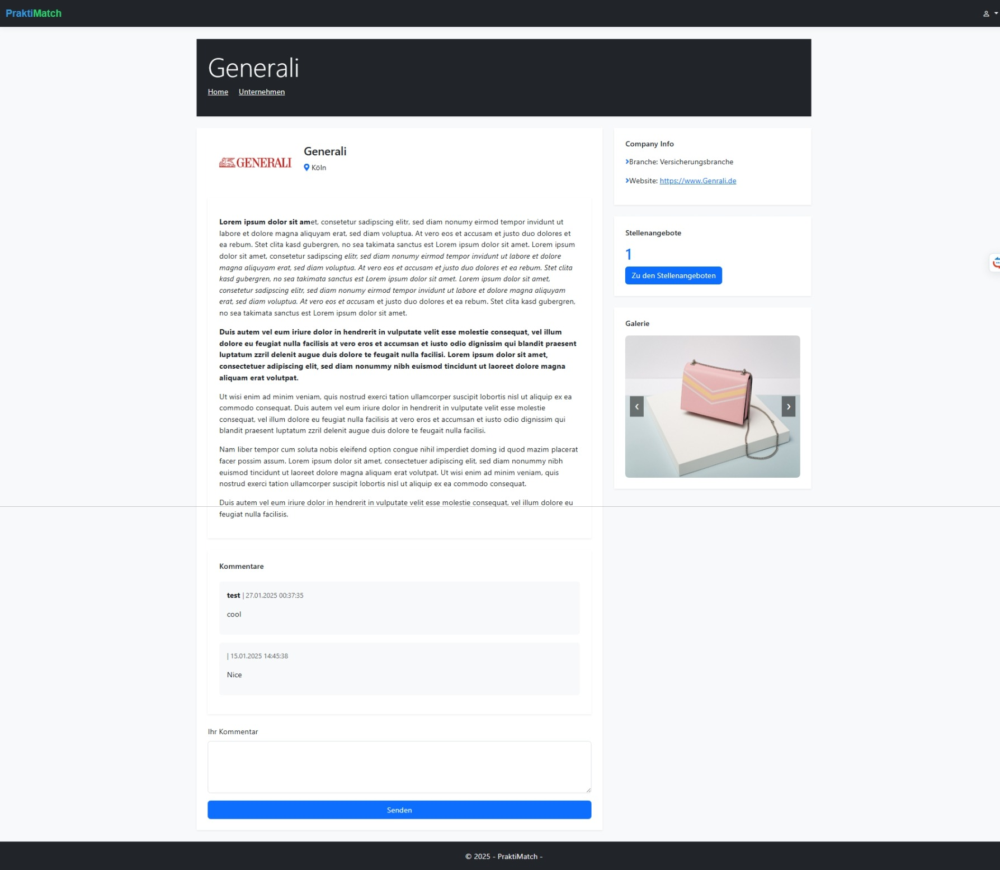
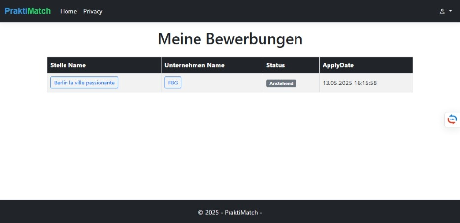
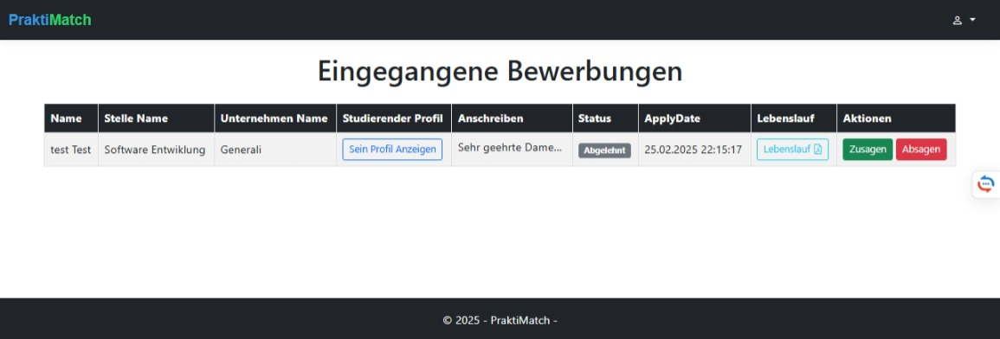
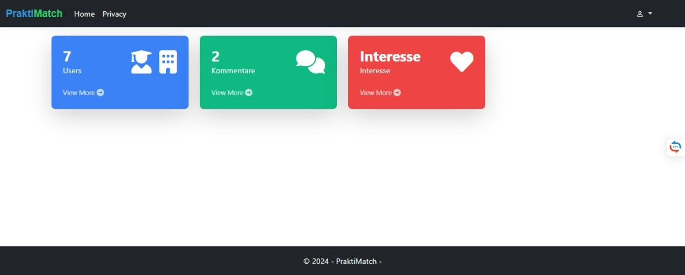

# 🎓 PraktiMatch

**PraktiMatch** ist eine innovative Plattform, die **Studenten** und **Unternehmen** bei der Vermittlung von Praktikumsplätzen unterstützt.  
Sie bietet moderne Funktionen wie **Profilverwaltung**, **intelligente Empfehlungen**, und eine integrierte **Bewerbungsfunktion**.

---

## 🚀 Hauptfunktionen

### 👤 Profilverwaltung

- **Studenten:** Erstellen und personalisieren ihr Profil mit Fähigkeiten, Erfahrungen und Präferenzen
- **Unternehmen:** Präsentieren ihre Firma und veröffentlichen attraktive Praktikumsstellen

### 🔍 Praktikumsvermittlung

- Studenten durchsuchen relevante Praktikumsangebote
- Unternehmen finden gezielt passende Bewerber

### 🤖 Empfehlungssystem

- Automatische Vorschläge basierend auf Interessen und Fähigkeiten der Nutzer
- Personalisierte Empfehlungen für passende Praktika oder Kandidaten

### 🔐 Authentifizierung & Registrierung

- Sichere Anmeldung für beide Rollen (Student / Unternehmen)

### 📝 Bewerbungssystem

- Studenten bewerben sich direkt auf Praktikumsstellen
- Unternehmen verwalten eingegangene Bewerbungen im Dashboard

---

## 📸 Screenshots

### 🏠 Startseite
- **Studentensicht**  
  
- **Unternehmenssicht**  
  

### 👤 Studentenprofil
- **Studentenprofil** 

### 🏢 Unternehmensprofil
- **Unternehmensprofil** 

### 🔍 Praktikumsangebote
- **Stellenübersicht**  
  
- **Stellendetails**  
  

### 📝 Bewerbungssystem
- **Bewerbung Student für Stelle**  

- **Meine Bewerbung Student **  

- **Eingegangene Bewerbungen Unternehmen** 

### 🔐 Login & Registrierung
- **Login**  
  
- **Registrierung**  
  

### 🛡️ Adminbereich
- **Admin Dashboard**  
  

---

## 🛠️ Verwendete Technologien

- ASP.NET Core MVC
- ASP.NET Identity
- Entity Framework Core
- Bootstrap 5
- MS SQL Server

---

## 🚧 Lokale Installation

### Voraussetzungen

- [.NET SDK 8.0+](https://dotnet.microsoft.com/en-us/download)
- Visual Studio 2022 / 2025 mit ASP.NET Core Workload
- SQL Server Express oder SQLite

### Schritte
git clone https://github.com/Fantomas077/praktimatch.git
cd praktimatch
dotnet ef database update
dotnet run
